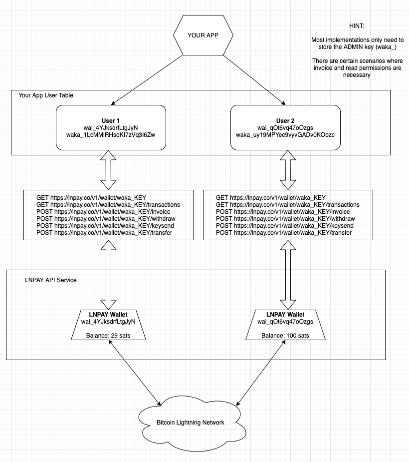

# How to Structure Your App

See below for a general diagram on the intended use-case for outsource custodial wallets. Of course there are many different ways to do this, but the general idea here is to provide a lightweight LN wallet for your users.

